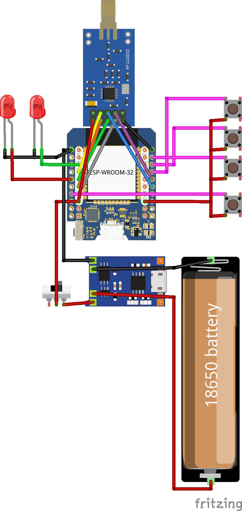

# Esp32-CC1101-Standalone

This is a Standalone-Version with 4 Push-Buttons and 2 Led's to indicate RX and TX Operations. It is for Example possible to define 4 Signals in the Arduino Code that are transmitted when a button is pressed. 

> **_NOTE:_**  Those Signals can also be created out .sub Files that were recorded with a Flipper Zero Device. See [Transmit Flipper Zero .sub Files](## Transmit Flipper Zero .sub Files) for more Details.


## Flipper Zero .sub File Support

Since the Flipper Zero also utilizes a CC1101 Transceiver for Sub-Ghz Operations i wanted to make use of the large amount of recorded .sub Files that are provided by the Community.
With this Setup it is possible to transmit .sub Files that were recorded using a Flipper Zero Device. Currently the Implementation requires the following the Properties in the .sub File:

| Property | Value |
| ------ | ------ |
| Filetype | Flipper SubGhz RAW File |
| Preset | FuriHalSubGhzPresetOok650Async or FuriHalSubGhzPresetOok270Async |
| Protocol | RAW |

More supported Properties will be implemented in the Future, however those Properties are set in most of the public available .sub Files already.

## Transmit Flipper Zero .sub Files
In order to transmit a Signal that was recorded with a Flipper Zero Device you need to extract all Samples stored in the .sub File you want to transmit. I wrote a simple Web-based Tool to make this as easy as possible.

You can find the Samples-Extractor-Tool here: LINK_TO_TOOL

You simple need to insert the desired Filecontent int the Textbox and press the Extract Button. After that you will be provided with a piece of Code that you can insert into your Arduino Code. The provided Code should look similiar to this:

```
#define LENGTH_SAMPLES_MY_SIGNAL 5
int samples_my_signal[LENGTH_SAMPLES_MY_SIGNAL] = {250,-250,250,-250,250};
```

If you want to transmit the extracted Signal, e.g. after a button was clicked, you can use the following Method:  "" Method.

```
void sendSamples(int samples[], int samplesLenght, float mhz)
```

where samples is the Integer Array of your Signal's samples, samplesLength is the Length of that Array and mhz is the frequency you want to transmit on.

Your final Code should look close to this:

```
sendSamples(samples_my_signal, LENGTH_SAMPLES_MY_SIGNAL, 433.92);
```


## Hardware

For this Project i used a ESP32 D1 Mini NodeMCU connected to a TI-CC1101 Transceiver (10 PIN Version). I added 2 Leds to indicate RX and TX Operations and 4 Pushbuttons to interact with the User. For Example to transmit hardcoded Signals. Optionally this Setup can be powered with a 18650 Battery Cell connected via a TP4056 Charging Module and a Switch to toggle the Device on/off.

 


## ESP32 Code

The ESP32 Code included in this Repository can be used with the Arduino-IDE. The Project can be opened and flashed to your Microcontroller.

The following Libraries are used in the Sketch:

| Library | Source |
| ------ | ------ |
| ELECHOUSE_CC1101_SRC_DRV | [https://github.com/LSatan/SmartRC-CC1101-Driver-Lib](https://github.com/LSatan/SmartRC-CC1101-Driver-Lib) |
