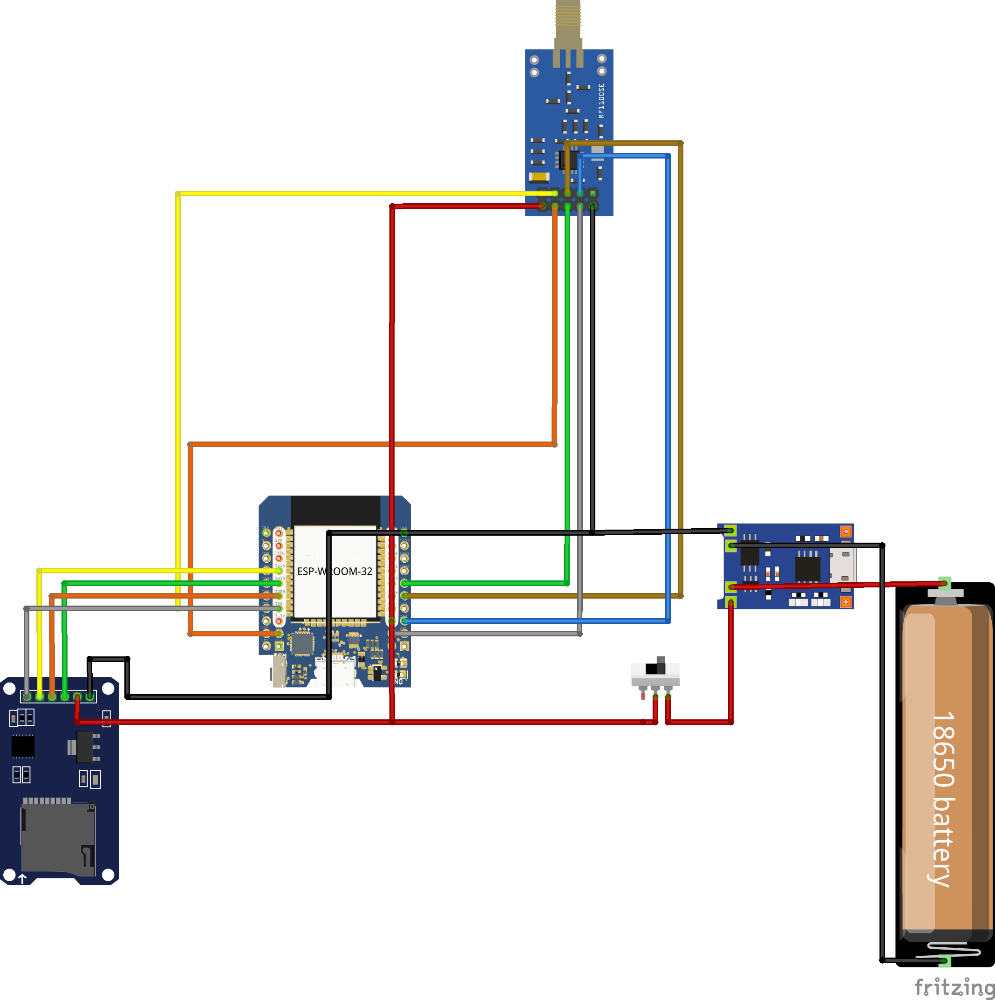

# Esp32-SubGhz

This Project aims to utilize low cost Microcontrollers to receive and transmit Signals in the Sub-Ghz Frequency range. The ESP32 can be controlled using an Android App that is connected via Bluetooth.

> **_NOTE:_**  This Project is in a very early State.  Contribution by anyone is Welcome.

## Flipper Zero .sub File Support

Since the Flipper Zero also utilizes a CC1101 Transceiver for Sub-Ghz Operations i wanted to make use of the large amount of recorded .sub Files that are provided by the Community.
With this Setup it is possible to transmit .sub Files that were recorded using a Flipper Zero Device. Those Files need to be located on the Micro-SD Card. Currently the Implementation requires the following the Properties in the .sub File:

| Property | Value |
| ------ | ------ |
| Filetype | Flipper SubGhz RAW File |
| Preset | FuriHalSubGhzPresetOok650Async or FuriHalSubGhzPresetOok270Async |
| Protocol | RAW |

More supported Properties will be implemented in the Future, however those Properties are set in most of the public available .sub Files already.

## Hardware

For this Project i used a ESP32 D1 Mini NodeMCU connected to a TI-CC1101 Transceiver (10 PIN Version) and a Micro-SD Module for Data Access. Optionally this Setup can be powered with a 18650 Battery Cell connected via a TP4056 Charging Module and a Switch to toggle the Device on/off.

See [Wiring Table](./wiringTable.md) for more Details. 

Other Combinations (e.g. utilizing a XD-RF-5V as 433 Mhz Transmitter only) are possible with some Modifications too.

## Android App

The Android app will let you Search for Bluetooth Devices nearby. By default the advertised Bluetooth Devicename is: Esp32-SubGhz. after you click on the Item in the List of found Devices within the App it will connect to the ESP32 and you are prompted with a List of Files and Folders that are located on your Micro-SD Card. You can now navigate those Folders. If you click on a .sub File, the App will issue a Command to the ESP32 executing the Transmission of the Files RAW Data.

## ESP32 Code

The ESP32 Code included in this Repository can be used with the Arduino-IDE. The Project can be opened and flashed to your Microcontroller.

The following Libraries are used in the Sketch:

| Library | Source |
| ------ | ------ |
| SdFat | [https://github.com/greiman/SdFat](https://github.com/greiman/SdFat) |
| ELECHOUSE_CC1101_SRC_DRV | [https://github.com/LSatan/SmartRC-CC1101-Driver-Lib](https://github.com/LSatan/SmartRC-CC1101-Driver-Lib) |
| ArduinoJson | [https://arduinojson.org/](https://arduinojson.org/) |
| BluetoothSerial | [https://github.com/espressif/arduino-esp32/tree/master/libraries/BluetoothSerial](https://github.com/espressif/arduino-esp32/tree/master/libraries/BluetoothSerial) |

